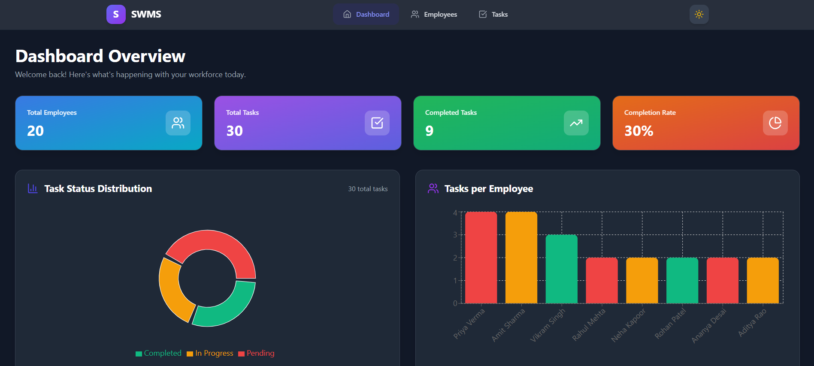
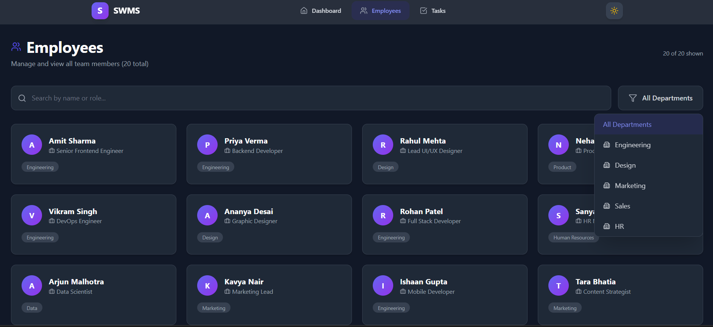
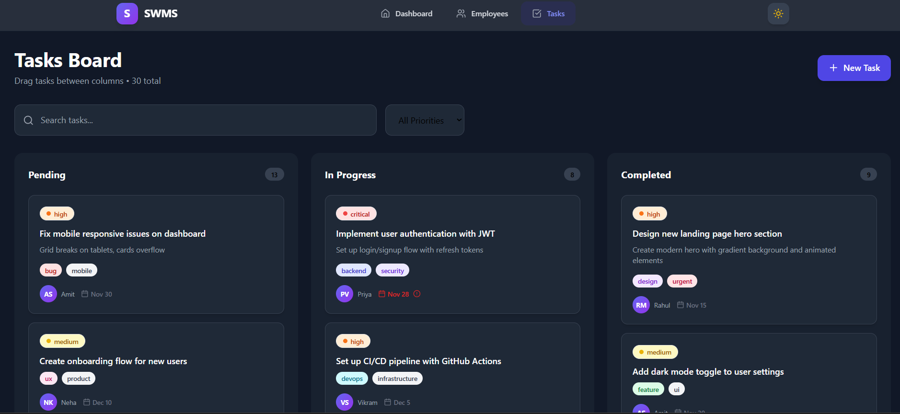
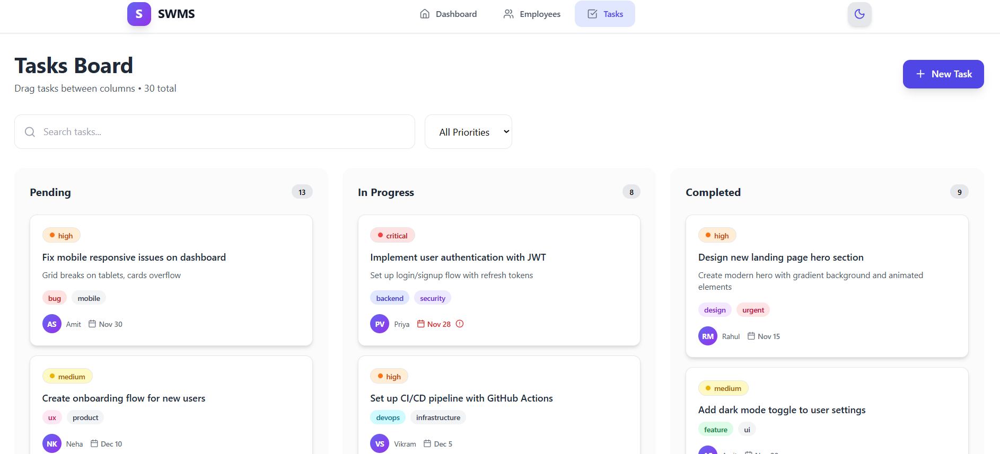

# Smart Workforce Management System (SWMS)

Smart Workforce Management System is a modern, responsive web application built using **React and Tailwind CSS**. It provides an interactive dashboard to manage employees and tasks with features like analytics, task tracking using a Kanban board, dark mode, and smooth UI animations.

This project was developed as part of the **ProU Technology Online Assessment (Track 1 – Frontend)** and is structured to be easily extendable for full-stack integration.

## Features

### Dashboard

- Visual analytics using charts
- Task status distribution (Pie Chart)
- Tasks per employee (Bar Chart)
- Summary cards for employees, tasks, and completion rate

### Employee Management

- Search by employee name or role
- Department-based filtering
- Clean, responsive employee cards
- Animated grid layout

### Task Management (Kanban Board)

- Drag and drop tasks between statuses
- Task priority filtering
- Search tasks by title or description
- Priority and label indicators
- Assigned employee avatars

### UI & UX

- Fully responsive design
- Dark and light mode with persistent theme
- Smooth animations using Framer Motion
- Clean and modern user interface

## Tech Stack

### Frontend

- Reactjs (Create React App)
- Tailwind CSS
- Framer Motion
- Recharts
- Lucide React Icons

### Data

- Mock JSON data

## Setup Instructions

### 1. Clone the Repository

git clone https://github.com/Pmaheshwari11/swms.git
cd swms-frontend

### 2. Install Dependencies

npm install

### 3. Run the Application

npm start

## Screenshots

